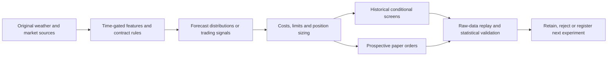

# WeatherPred

**Quantitative weather-market research, from original data to auditable paper fills.**

[Project case study](https://martinmashalov.github.io/weatherpred.html) ·
[Strategy guide](docs/STRATEGIES.md) · [Mathematics](docs/MATHEMATICS.md) ·
[Project brief](https://martinmashalov.github.io/weatherpred-interview.html) ·
[Explore results](https://martinmashalov.github.io/weatherpred-results.html) ·
[Reproduce the checks](docs/REPRODUCIBILITY.md)

WeatherPred asks when a weather forecast or market signal becomes a trade that
can survive fees, spreads, delayed execution and uncertainty. It combines NOAA
forecasts, NWS climate reports, exact Kalshi contract rules and market data with
interpretable probability models, an automated experiment runner and a forward
paper-execution ledger.

**Current conclusion: profitability is unproven.** The contribution is a
reproducible system that can reject attractive but unsupported trading claims.
No real-money orders were submitted.

## Evidence at a glance

The September 6, 2026 research snapshot contains:

| Evidence | Result |
|---|---|
| Historical development universe | 11,610 contracts across 1,935 weather events |
| Trading-policy search | 612 policy definitions under three cost cases: **1,836 comparisons** |
| Price-behavior results | 30 of 576 policies have positive costed development P&L; none qualifies after the statistical search adjustment |
| Chronological monthly selector | **−$4.45** on a conditional $100 account; only earlier released returns select the next month's policy |
| Independent arithmetic audit | 253,227 hypothetical entries, 100,170 quoted exits and 153,057 settlements reconstructed; maximum discrepancy 1.11e−16 |
| Forward execution checkpoint | 64 taker and 22 maker fill records across 32 alternative paper accounts; no settlements at that checkpoint |
| Software verification | 89 tests passed in the published verification log |

Counts across alternative policies reuse the same underlying events. They are
not independent trades or evidence of production investment performance.
Historical candles lack depth and cannot prove fills. The paper checkpoint
likewise represents one underlying weather event, not 86 independent trials.

Sources: [machine-readable summary](evidence/summary.json),
[all policy results](evidence/strategy-results.json),
[raw-price audit](evidence/E013_audit.json),
[paper audit](evidence/E009_audit.json), [verification output](evidence/verification.txt).

**Later forward update, September 6 at 15:12 UTC:** the first paper event has
settled. All 32 alternative accounts lost between $0.48 and $4.16 on that one
event; 57 positions were independently replayed against its finalized result.
E015 separately registered nine paired-maker alternatives before its first
15:20 decisions. It tests spread capture with unmatched inventory and deliberately
locked capital. E016 corrects same-contract offsetting in a separately registered
15:40 cohort. The original evidence snapshot above remains dated and unchanged.
See the [experiment ledger](EXPERIMENTS.md) for the source records and limits.
The [later forward audit checkpoint](evidence/forward-update-2026-09-06.json)
contains replay reports for E009, E015 and E016, including simulated fills and
matched cash offsets. Its [verification log](evidence/verification-2026-09-06-1552.txt)
records 95 passing tests. Audit counts across alternatives are not independent
trades or proof of profitability.

**16:21 UTC research update:** the second hourly event has finalized; cumulative
realized results are negative in 31 of the 32 original paper alternatives, while
one is +$0.6371 with further open positions. See the [two-event record](evidence/E009_two_settlements.json).
A separately frozen [conditional hourly model](evidence/E018_model_card.json)
adds time-of-day patterns, coefficient shrinkage and heavier-tailed errors.
It was selected using August data only and registered before new 16:30–16:55
paper decisions. Its development improvement is not independent validation.
The [latest verification](evidence/E018_verification.txt) records 100 passing tests.

**16:54 UTC structural research update:** E019 registers a separate daily/weekend
rain-pair experiment across 19 cities. An apparent NYC price gap survives the
initial cost screen, while Houston's disappears in the book. Both orders must
fill independently at later prices; source-consistent payout equivalence remains
conditional. The [registered protocol](evidence/E019_registration.json) precedes
17:00–18:20 paper decisions. See the [source check](evidence/E019_source_consistency.json)
and [rain-pair mathematics](docs/MATHEMATICS.md#21-conditional-rain-calendar-pairs-and-unequal-fills).
The [E019 verification log](evidence/E019_verification.txt) records the expanded checks.
At the first 17:00 decision, NYC's two legs received simulated fills in all three
scenarios. [Audited conditional settlement gains](evidence/E019_first_fills.json)
are $0.4113, $0.2873 and $0.1690 per alternative account, with no realized profit
yet. Different contracts retain their cash until settlement, and a source
inconsistency could invalidate the expected combined payout.

## What is implemented

- **Data and provenance:** public GET ingestion; original forecast/report versions;
  distinct initialization, valid, issue and receipt times; an append-only SQLite
  archive with content hashes and raw-data replay.
- **Forecasting:** persistence and trend baselines, Gaussian and empirical error
  distributions, station bias correction, positive-variance regression, logistic
  market calibration and constrained logarithmic forecast pooling.
- **Trading research:** complete-bracket consistency, momentum and reversal,
  buying/fading favorites and longshots, timed exits, settlement holds and
  preliminary observed-high constraints; a registered forward test of paired
  passive quotes and inventory-sensitive prices.
- **Execution:** future-book taker fills, conservative maker queues and
  trade-through rules, partial fills, exact fee accounting, cancellations,
  cash reservations, correlated exposure limits and finalized settlement.
- **Validation:** chronological selection, untouched final holdout boundaries,
  shared day-block bootstrap diagnostics, parameter-search accounting,
  frozen experiment registrations and retained failures.



## Start here

```sh
git clone https://github.com/MartinMashalov/WeatherPred.git
cd WeatherPred
uv sync --frozen
uv run pytest -q
uv run ruff check weatherpred tests research/experiments
uv run ruff format --check weatherpred tests research/experiments
```

No credentials or market downloads are needed for these tests. The public
repository includes compact evidence; the large raw archive and generated live
state are stored separately. Full historical replay requires that archive.
See [reproduction instructions](docs/REPRODUCIBILITY.md) before running an
acquisition or a recorded experiment.

## Read the research

| Document | Purpose |
|---|---|
| [Strategy guide](docs/STRATEGIES.md) | Each implemented strategy, its rationale, code and result |
| [Mathematics](docs/MATHEMATICS.md) | Equations, assumptions and a forecast-to-order example for the models, fees, fills, sizing and validation |
| [Interview guide](docs/INTERVIEW_GUIDE.md) | A concise project explanation, defensible résumé bullets and technical discussion points |
| [Experiment ledger](EXPERIMENTS.md) | Registered hypotheses, amendments, failures and subsequent decisions |
| [Research sources](research.md) | Primary literature and documentation connected to experiments |
| [Validation protocol](config/validation.json) | Explicit requirements before claiming a profitable strategy |
| [Research status](docs/REQUIREMENTS.md) | Remaining evidence and engineering work |

The strongest lesson so far is practical: a small forecast-score improvement
can disappear after costs, a winning-looking backtest can fail chronological
selection, and even a preliminary official temperature report can conflict with
final settlement. Those failures remain visible in the results.

Python, NumPy, SciPy, pandas, httpx, SQLite, pytest and Ruff. Developed with AI
coding assistance; implementation and empirical claims are backed by explicit
checks and documented limitations. Code is available under the [MIT license](LICENSE).
