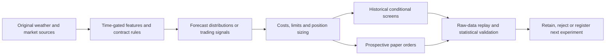

# WeatherPred

**Quantitative weather-market research, from original data to auditable paper fills.**

[Project case study](https://martinmashalov.github.io/weatherpred.html) ·
[Strategy guide](docs/STRATEGIES.md) · [Mathematics](docs/MATHEMATICS.md) ·
[Explore results](https://martinmashalov.github.io/weatherpred-results.html) ·
[Reproduce the checks](docs/REPRODUCIBILITY.md)

WeatherPred asks when a weather forecast or market signal becomes a trade that
can survive fees, spreads, delayed execution and uncertainty. It combines NOAA
forecasts, NWS climate reports, exact Kalshi contract rules and market data with
interpretable probability models, an automated experiment runner and a forward
paper-execution ledger.

**Current conclusion: profitability is unproven.** The contribution is a
reproducible system that can reject attractive but unsupported trading claims.
No real-money orders were submitted.

## Evidence at a glance

The September 6, 2026 research snapshot contains:

| Evidence | Result |
|---|---|
| Historical development universe | 11,610 contracts across 1,935 weather events |
| Trading-policy search | 612 policy definitions under three cost cases: **1,836 comparisons** |
| Price-behavior results | 30 of 576 policies have positive costed development P&L; none qualifies after the statistical search adjustment |
| Chronological monthly selector | **−$4.45** on a conditional $100 account; only earlier released returns select the next month's policy |
| Independent arithmetic audit | 253,227 hypothetical entries, 100,170 quoted exits and 153,057 settlements reconstructed; maximum discrepancy 1.11e−16 |
| Forward execution checkpoint | 64 taker and 22 maker fill records across 32 alternative paper accounts; no settlements at that checkpoint |
| Software verification | 89 tests passed in the published verification log |

Counts across alternative policies reuse the same underlying events. They are
not independent trades or evidence of production investment performance.
Historical candles lack depth and cannot prove fills. The paper checkpoint
likewise represents one underlying weather event, not 86 independent trials.

Sources: [machine-readable summary](evidence/summary.json),
[all policy results](evidence/strategy-results.json),
[raw-price audit](evidence/E013_audit.json),
[paper audit](evidence/E009_audit.json), [verification output](evidence/verification.txt).

## What is implemented

- **Data and provenance:** public GET ingestion; original forecast/report versions;
  distinct initialization, valid, issue and receipt times; an append-only SQLite
  archive with content hashes and raw-data replay.
- **Forecasting:** persistence and trend baselines, Gaussian and empirical error
  distributions, station bias correction, positive-variance regression, logistic
  market calibration and constrained logarithmic forecast pooling.
- **Trading research:** complete-bracket consistency, momentum and reversal,
  buying/fading favorites and longshots, timed exits, settlement holds and
  preliminary observed-high constraints.
- **Execution:** future-book taker fills, conservative maker queues and
  trade-through rules, partial fills, exact fee accounting, cancellations,
  cash reservations, correlated exposure limits and finalized settlement.
- **Validation:** chronological selection, untouched final holdout boundaries,
  shared day-block bootstrap diagnostics, parameter-search accounting,
  frozen experiment registrations and retained failures.



## Start here

```sh
git clone https://github.com/MartinMashalov/WeatherPred.git
cd WeatherPred
uv sync --frozen
uv run pytest -q
uv run ruff check weatherpred tests research/experiments
uv run ruff format --check weatherpred tests research/experiments
```

No credentials or market downloads are needed for these tests. The public
repository includes compact evidence; the large raw archive and generated live
state are stored separately. Full historical replay requires that archive.
See [reproduction instructions](docs/REPRODUCIBILITY.md) before running an
acquisition or a recorded experiment.

## Read the research

| Document | Purpose |
|---|---|
| [Strategy guide](docs/STRATEGIES.md) | Each implemented strategy, its rationale, code and result |
| [Mathematics](docs/MATHEMATICS.md) | Equations, assumptions and worked examples for the models, fees, fills, sizing and validation |
| [Interview guide](docs/INTERVIEW_GUIDE.md) | A concise project explanation, defensible résumé bullets and technical discussion points |
| [Experiment ledger](EXPERIMENTS.md) | Registered hypotheses, amendments, failures and subsequent decisions |
| [Research sources](research.md) | Primary literature and documentation connected to experiments |
| [Validation protocol](config/validation.json) | Explicit requirements before claiming a profitable strategy |
| [Research status](docs/REQUIREMENTS.md) | Remaining evidence and engineering work |

The strongest lesson so far is practical: a small forecast-score improvement
can disappear after costs, a winning-looking backtest can fail chronological
selection, and even a preliminary official temperature report can conflict with
final settlement. Those failures remain visible in the results.

Python, NumPy, SciPy, pandas, httpx, SQLite, pytest and Ruff. Developed with AI
coding assistance; implementation and empirical claims are backed by explicit
checks and documented limitations. Code is available under the [MIT license](LICENSE).
